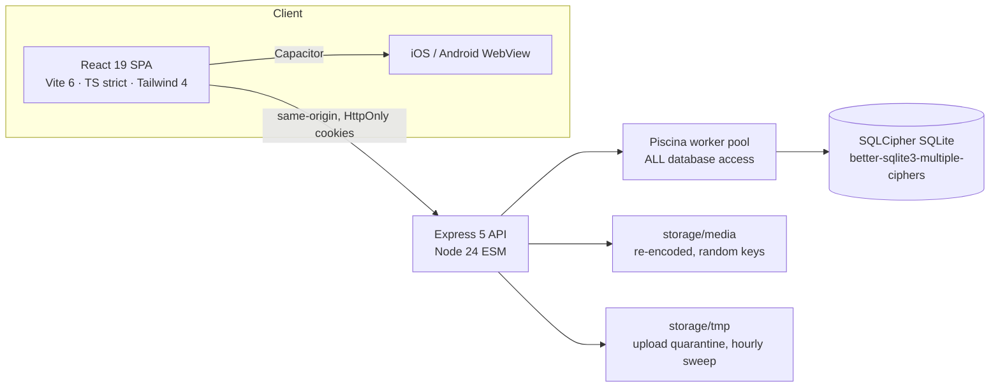

# Architecture overview

## System shape

## The laws this codebase actually enforces

**Nothing touches the database off the worker pool.** `better-sqlite3` is synchronous by design;
a Promise around a sync call moves nothing off the event loop. Only `src/db/index.js` is imported
by the app, and only `src/db/worker.js` opens a connection.

**Routes are thin.** Validate with a `.strict()` zod schema → authorize → one worker call →
shape the response. No SQL lives in a route file.

**A row you may not see is indistinguishable from one that does not exist.** Every ownership
miss answers **404**, never 403 — a 403 confirms the id is real, which is enough to enumerate
another coach's private library.

**Guards live inside the UPDATE**, not in a preceding SELECT, so two racing requests cannot both
win. Anything with a branch gets a named worker function; `writeTx` is for simple writes only.

**The client is never trusted about anything.** Not a price, not a role, not a file's type, not
its own language header. Uploads are sniffed from magic bytes and re-encoded; the accent contrast
guard re-runs server-side; `status` and `owner_id` are not accepted from any request body.

**The build refuses drift.** `check-tokens` fails on a raw colour, radius, duration, off-grid
spacing, a sub-44px control, or a hand-rolled `<button>` outside the primitives folder.

## Security posture

OWASP ASVS L2 aligned. Strict CSP with no `unsafe-inline` (the pre-paint theme script ships as a
sha256 hash), HSTS in production, `frame-ancestors 'none'`, exact-origin CORS, per-IP **and**
per-account rate limits, argon2id, 15-minute access JWTs with a `kid` keyring, rotating opaque
refresh tokens with family reuse detection and a `session_version` kill-switch, and an
append-only `audit_log` enforced by triggers rather than by convention.

## Migrations

Numbered files under `src/db/migrations/`; the number is the target `PRAGMA user_version`, and
the bump happens **inside** the file's own transaction — a crash mid-file rolls back the version
with it ([[0001 Numbered migrations via PRAGMA user_version|ADR-0001]]).
`npm run migrate` applies them without booting the server.

## Stack

Backend: Express 5, better-sqlite3-multiple-ciphers, Piscina, jose, argon2, pino, zod, helmet,
multer, file-type, sharp.
Frontend: React 19, Tailwind 4, react-router 8 (`react-router/dom` for the data router),
TanStack Query, react-hook-form, Motion, Lucide, i18next, Capacitor.

## Related

[[ERD]] · [[Endpoints]] · [[TODO Master]] · [[0000 Index]]
