# Data model — schema version 22

> [!info] Generated file
> Written by `backend/scripts/brain-gen.mjs` from the LIVE schema and the mounted routers.
> Do not hand-edit — run `npm run brain:gen` instead. Last generated: 2026-08-09.

81 tables, plus 4 FTS5 shadow tables (`coach_posts_fts`, `exercise_translations_fts`, `food_translations_fts`, `foods_fts`).

```mermaid
erDiagram
  users ||--o{ audit_log : "actor_id"
  muscle_groups ||--o{ body_area_muscle_map : "muscle_group_id"
  measurement_metrics ||--o{ body_measurements : "metric_key"
  users ||--o{ body_measurements : "client_user_id"
  teams ||--o{ coach_clients : "team_id"
  users ||--o{ coach_clients : "client_id"
  users ||--o{ coach_clients : "coach_id"
  coach_profiles ||--o{ coach_follows : "coach_user_id"
  users ||--o{ coach_follows : "follower_user_id"
  users ||--o{ coach_posts : "removed_by"
  public_currencies ||--o{ coach_posts : "price_currency"
  public_cities ||--o{ coach_posts : "city_key"
  post_kinds ||--o{ coach_posts : "kind_key"
  users ||--o{ coach_posts : "author_user_id"
  coach_specialties ||--o{ coach_profile_specialties : "specialty_key"
  coach_profiles ||--o{ coach_profile_specialties : "user_id"
  users ||--o{ coach_profiles : "removed_by"
  users ||--o{ coach_profiles : "verified_by"
  public_cities ||--o{ coach_profiles : "city_key"
  users ||--o{ coach_profiles : "user_id"
  coin_purchases ||--o{ coin_entitlements : "purchase_id"
  coin_store_items ||--o{ coin_entitlements : "item_id"
  users ||--o{ coin_entitlements : "user_id"
  users ||--o{ coin_ledger : "actor_user_id"
  coin_reasons ||--o{ coin_ledger : "reason_key"
  users ||--o{ coin_ledger : "user_id"
  coin_store_items ||--o{ coin_purchases : "item_id"
  users ||--o{ coin_purchases : "user_id"
  users ||--o{ coin_wallets : "user_id"
  users ||--o{ content_reports : "resolved_by"
  report_statuses ||--o{ content_reports : "status_key"
  report_reasons ||--o{ content_reports : "reason_key"
  users ||--o{ content_reports : "reporter_user_id"
  users ||--o{ content_reports : "subject_author_user_id"
  coach_profiles ||--o{ content_reports : "subject_profile_id"
  coach_posts ||--o{ content_reports : "subject_post_id"
  users ||--o{ conversations : "blocked_by"
  users ||--o{ conversations : "coach_id"
  users ||--o{ conversations : "client_id"
  coach_clients ||--o{ conversations : "coach_client_id"
  users ||--o{ element_style_config : "updated_by"
  equipment ||--o{ exercise_equipment_map : "equipment_id"
  exercises ||--o{ exercise_equipment_map : "exercise_id"
  exercises ||--o{ exercise_media : "exercise_id"
  muscle_groups ||--o{ exercise_muscle_map : "muscle_group_id"
  exercises ||--o{ exercise_muscle_map : "exercise_id"
  exercises ||--o{ exercise_translations : "exercise_id"
  users ||--o{ exercises : "owner_id"
  foods ||--o{ food_translations : "food_id"
  users ||--o{ foods : "owner_user_id"
  guidelines_versions ||--o{ guidelines_acceptances : "version"
  users ||--o{ guidelines_acceptances : "user_id"
  teams ||--o{ invite_codes : "team_id"
  users ||--o{ invite_codes : "coach_id"
  users ||--o{ invite_redemptions : "user_id"
  invite_codes ||--o{ invite_redemptions : "code_id"
  foods ||--o{ meal_items : "food_id"
  meals ||--o{ meal_items : "meal_id"
  nutrition_plans ||--o{ meal_items : "plan_id"
  nutrition_plan_days ||--o{ meals : "day_id"
  nutrition_plans ||--o{ meals : "plan_id"
  messages ||--o{ message_attachments : "message_id"
  users ||--o{ message_reports : "resolved_by"
  users ||--o{ message_reports : "reporter_id"
  messages ||--o{ message_reports : "message_id"
  users ||--o{ messages : "sender_id"
  conversations ||--o{ messages : "conversation_id"
  coach_clients ||--o{ notifications : "coach_client_id"
  users ||--o{ notifications : "user_id"
  foods ||--o{ nutrition_log_items : "food_id"
  nutrition_plan_days ||--o{ nutrition_log_items : "plan_day_id"
  users ||--o{ nutrition_log_items : "client_user_id"
  nutrition_plans ||--o{ nutrition_plan_days : "plan_id"
  nutrition_plans ||--o{ nutrition_plans : "source_plan_id"
  users ||--o{ nutrition_plans : "client_user_id"
  coach_clients ||--o{ nutrition_plans : "coach_client_id"
  users ||--o{ nutrition_plans : "author_user_id"
  equipment ||--o{ onboarding_equipment : "equipment_id"
  onboarding_profiles ||--o{ onboarding_equipment : "user_id"
  onboarding_profiles ||--o{ onboarding_limitations : "user_id"
  users ||--o{ onboarding_profiles : "user_id"
  post_media_mimes ||--o{ post_media : "mime"
  post_media_roles ||--o{ post_media : "role_key"
  coach_posts ||--o{ post_media : "post_id"
  coach_clients ||--o{ progress_access_log : "coach_client_id"
  users ||--o{ progress_access_log : "viewer_user_id"
  users ||--o{ progress_access_log : "subject_user_id"
  users ||--o{ progress_photos : "client_user_id"
  users ||--o{ progress_shares : "client_user_id"
  coach_clients ||--o{ progress_shares : "coach_client_id"
  users ||--o{ push_devices : "user_id"
  invite_codes ||--o{ referrals : "code_id"
  users ||--o{ referrals : "referred_user_id"
  users ||--o{ referrals : "coach_id"
  users ||--o{ refresh_tokens : "user_id"
  languages ||--o{ taxonomy_translations : "lang"
  users ||--o{ teams : "coach_id"
  achievements ||--o{ user_achievements : "achievement_key"
  users ||--o{ user_achievements : "user_id"
  theme_packs ||--o{ user_theme_prefs : "pack"
  users ||--o{ user_theme_prefs : "user_id"
  users ||--o{ users : "created_by"
  coach_clients ||--o{ workout_calendar_feeds : "coach_client_id"
  workout_plans ||--o{ workout_calendar_feeds : "plan_id"
  users ||--o{ workout_calendar_feeds : "user_id"
  exercises ||--o{ workout_log_exercises : "substituted_for_exercise_id"
  workout_plan_exercises ||--o{ workout_log_exercises : "plan_exercise_id"
  exercises ||--o{ workout_log_exercises : "exercise_id"
  users ||--o{ workout_log_exercises : "client_user_id"
  workout_logs ||--o{ workout_log_exercises : "log_id"
  workout_log_sets ||--o{ workout_log_sets : "corrects_set_id"
  workout_plan_set_targets ||--o{ workout_log_sets : "plan_set_target_id"
  exercises ||--o{ workout_log_sets : "exercise_id"
  users ||--o{ workout_log_sets : "client_user_id"
  workout_logs ||--o{ workout_log_sets : "log_id"
  workout_log_exercises ||--o{ workout_log_sets : "log_exercise_id"
  workout_plan_days ||--o{ workout_logs : "plan_day_id"
  workout_plans ||--o{ workout_logs : "plan_id"
  coach_clients ||--o{ workout_logs : "coach_client_id"
  users ||--o{ workout_logs : "client_user_id"
  workout_plan_days ||--o{ workout_plan_blocks : "day_id"
  workout_plans ||--o{ workout_plan_blocks : "plan_id"
  users ||--o{ workout_plan_day_exceptions : "created_by"
  workout_plan_days ||--o{ workout_plan_day_exceptions : "day_id"
  workout_plans ||--o{ workout_plan_day_exceptions : "plan_id"
  workout_plans ||--o{ workout_plan_days : "plan_id"
  exercises ||--o{ workout_plan_exercises : "exercise_id"
  workout_plan_blocks ||--o{ workout_plan_exercises : "block_id"
  workout_plans ||--o{ workout_plan_exercises : "plan_id"
  workout_plan_exercises ||--o{ workout_plan_set_targets : "exercise_row_id"
  workout_plans ||--o{ workout_plan_set_targets : "plan_id"
  workout_plans ||--o{ workout_plans : "source_plan_id"
  users ||--o{ workout_plans : "client_user_id"
  coach_clients ||--o{ workout_plans : "coach_client_id"
  users ||--o{ workout_plans : "author_user_id"
  workout_logs ||--o{ workout_pr_events : "log_id"
  workout_log_sets ||--o{ workout_pr_events : "source_set_id"
  exercises ||--o{ workout_pr_events : "exercise_id"
  users ||--o{ workout_pr_events : "client_user_id"
```

## Tables

| Table | Columns | Rows |
|---|---|---|
| [[achievements]] | 6 | 7 |
| [[audit_log]] | 9 | 2 |
| [[body_area_muscle_map]] | 3 | 44 |
| [[body_measurements]] | 8 | 8 |
| [[coach_clients]] | 11 | 3 |
| [[coach_follows]] | 3 | 0 |
| [[coach_posts]] | 24 | 2 |
| [[coach_profile_specialties]] | 2 | 1 |
| [[coach_profiles]] | 17 | 1 |
| [[coach_specialties]] | 4 | 14 |
| [[coin_entitlements]] | 8 | 1 |
| [[coin_ledger]] | 11 | 2 |
| [[coin_purchases]] | 9 | 1 |
| [[coin_reasons]] | 6 | 4 |
| [[coin_store_items]] | 10 | 2 |
| [[coin_wallets]] | 4 | 14 |
| [[content_reports]] | 15 | 0 |
| [[conversations]] | 9 | 1 |
| [[element_style_config]] | 4 | 27 |
| [[equipment]] | 4 | 16 |
| [[exercise_equipment_map]] | 2 | 1432 |
| [[exercise_media]] | 11 | 0 |
| [[exercise_muscle_map]] | 3 | 4101 |
| [[exercise_translations]] | 10 | 4790 |
| [[exercises]] | 16 | 1652 |
| [[food_translations]] | 8 | 285 |
| [[foods]] | 17 | 95 |
| [[guidelines_acceptances]] | 4 | 1 |
| [[guidelines_versions]] | 4 | 1 |
| [[invite_codes]] | 11 | 6 |
| [[invite_redemptions]] | 6 | 3 |
| [[languages]] | 6 | 25 |
| [[meal_items]] | 15 | 0 |
| [[meals]] | 9 | 1 |
| [[measurement_metrics]] | 6 | 15 |
| [[message_attachments]] | 7 | 0 |
| [[message_reports]] | 10 | 0 |
| [[messages]] | 8 | 2 |
| [[muscle_groups]] | 5 | 20 |
| [[notifications]] | 9 | 2 |
| [[nutrition_log_items]] | 16 | 1 |
| [[nutrition_plan_days]] | 11 | 1 |
| [[nutrition_plans]] | 18 | 1 |
| [[onboarding_equipment]] | 2 | 6 |
| [[onboarding_limitations]] | 6 | 3 |
| [[onboarding_profiles]] | 18 | 3 |
| [[post_kinds]] | 6 | 3 |
| [[post_media]] | 15 | 0 |
| [[post_media_mimes]] | 2 | 3 |
| [[post_media_roles]] | 1 | 2 |
| [[progress_access_log]] | 8 | 0 |
| [[progress_photos]] | 11 | 0 |
| [[progress_shares]] | 8 | 0 |
| [[public_cities]] | 5 | 10 |
| [[public_currencies]] | 3 | 4 |
| [[public_policy]] | 3 | 7 |
| [[push_devices]] | 7 | 0 |
| [[referrals]] | 6 | 3 |
| [[refresh_tokens]] | 9 | 107 |
| [[report_reasons]] | 5 | 12 |
| [[report_statuses]] | 3 | 5 |
| [[reserved_handles]] | 1 | 53 |
| [[retired_handles]] | 3 | 0 |
| [[schema_migrations]] | 2 | 21 |
| [[taxonomy_translations]] | 7 | 252 |
| [[teams]] | 7 | 0 |
| [[theme_packs]] | 6 | 7 |
| [[user_achievements]] | 7 | 0 |
| [[user_theme_prefs]] | 6 | 4 |
| [[users]] | 12 | 14 |
| [[workout_calendar_feeds]] | 11 | 0 |
| [[workout_log_exercises]] | 15 | 16 |
| [[workout_log_sets]] | 31 | 54 |
| [[workout_logs]] | 29 | 14 |
| [[workout_plan_blocks]] | 10 | 13 |
| [[workout_plan_day_exceptions]] | 9 | 0 |
| [[workout_plan_days]] | 11 | 14 |
| [[workout_plan_exercises]] | 23 | 15 |
| [[workout_plan_set_targets]] | 14 | 0 |
| [[workout_plans]] | 20 | 11 |
| [[workout_pr_events]] | 17 | 11 |

## Conventions that hold everywhere

- `INTEGER PRIMARY KEY id`; `created_at` / `updated_at` as unix epoch seconds.
- Enums are CHECK constraints; a lookup TABLE is used wherever an admin must edit the set.
- Junction tables for every m:n relation — never a JSON list of relations.
- JSON columns only for non-relational config blobs (a gradient definition, a notification payload).
- Every client-owned row carries an owner column with a composite index.
