# Data model — schema version 14

> [!info] Generated file
> Written by `backend/scripts/brain-gen.mjs` from the LIVE schema and the mounted routers.
> Do not hand-edit — run `npm run brain:gen` instead. Last generated: 2026-08-06.

40 tables, plus 1 FTS5 shadow table (`exercise_translations_fts`).

```mermaid
erDiagram
  users ||--o{ audit_log : "actor_id"
  muscle_groups ||--o{ body_area_muscle_map : "muscle_group_id"
  teams ||--o{ coach_clients : "team_id"
  users ||--o{ coach_clients : "client_id"
  users ||--o{ coach_clients : "coach_id"
  users ||--o{ conversations : "blocked_by"
  users ||--o{ conversations : "coach_id"
  users ||--o{ conversations : "client_id"
  coach_clients ||--o{ conversations : "coach_client_id"
  users ||--o{ element_style_config : "updated_by"
  equipment ||--o{ exercise_equipment_map : "equipment_id"
  exercises ||--o{ exercise_equipment_map : "exercise_id"
  exercises ||--o{ exercise_media : "exercise_id"
  muscle_groups ||--o{ exercise_muscle_map : "muscle_group_id"
  exercises ||--o{ exercise_muscle_map : "exercise_id"
  exercises ||--o{ exercise_translations : "exercise_id"
  users ||--o{ exercises : "owner_id"
  teams ||--o{ invite_codes : "team_id"
  users ||--o{ invite_codes : "coach_id"
  users ||--o{ invite_redemptions : "user_id"
  invite_codes ||--o{ invite_redemptions : "code_id"
  messages ||--o{ message_attachments : "message_id"
  users ||--o{ message_reports : "resolved_by"
  users ||--o{ message_reports : "reporter_id"
  messages ||--o{ message_reports : "message_id"
  users ||--o{ messages : "sender_id"
  conversations ||--o{ messages : "conversation_id"
  coach_clients ||--o{ notifications : "coach_client_id"
  users ||--o{ notifications : "user_id"
  equipment ||--o{ onboarding_equipment : "equipment_id"
  onboarding_profiles ||--o{ onboarding_equipment : "user_id"
  onboarding_profiles ||--o{ onboarding_limitations : "user_id"
  users ||--o{ onboarding_profiles : "user_id"
  users ||--o{ push_devices : "user_id"
  invite_codes ||--o{ referrals : "code_id"
  users ||--o{ referrals : "referred_user_id"
  users ||--o{ referrals : "coach_id"
  users ||--o{ refresh_tokens : "user_id"
  languages ||--o{ taxonomy_translations : "lang"
  users ||--o{ teams : "coach_id"
  users ||--o{ user_theme_prefs : "user_id"
  users ||--o{ users : "created_by"
  coach_clients ||--o{ workout_calendar_feeds : "coach_client_id"
  workout_plans ||--o{ workout_calendar_feeds : "plan_id"
  users ||--o{ workout_calendar_feeds : "user_id"
  exercises ||--o{ workout_log_exercises : "substituted_for_exercise_id"
  workout_plan_exercises ||--o{ workout_log_exercises : "plan_exercise_id"
  exercises ||--o{ workout_log_exercises : "exercise_id"
  users ||--o{ workout_log_exercises : "client_user_id"
  workout_logs ||--o{ workout_log_exercises : "log_id"
  workout_log_sets ||--o{ workout_log_sets : "corrects_set_id"
  workout_plan_set_targets ||--o{ workout_log_sets : "plan_set_target_id"
  exercises ||--o{ workout_log_sets : "exercise_id"
  users ||--o{ workout_log_sets : "client_user_id"
  workout_logs ||--o{ workout_log_sets : "log_id"
  workout_log_exercises ||--o{ workout_log_sets : "log_exercise_id"
  workout_plan_days ||--o{ workout_logs : "plan_day_id"
  workout_plans ||--o{ workout_logs : "plan_id"
  coach_clients ||--o{ workout_logs : "coach_client_id"
  users ||--o{ workout_logs : "client_user_id"
  workout_plan_days ||--o{ workout_plan_blocks : "day_id"
  workout_plans ||--o{ workout_plan_blocks : "plan_id"
  users ||--o{ workout_plan_day_exceptions : "created_by"
  workout_plan_days ||--o{ workout_plan_day_exceptions : "day_id"
  workout_plans ||--o{ workout_plan_day_exceptions : "plan_id"
  workout_plans ||--o{ workout_plan_days : "plan_id"
  exercises ||--o{ workout_plan_exercises : "exercise_id"
  workout_plan_blocks ||--o{ workout_plan_exercises : "block_id"
  workout_plans ||--o{ workout_plan_exercises : "plan_id"
  workout_plan_exercises ||--o{ workout_plan_set_targets : "exercise_row_id"
  workout_plans ||--o{ workout_plan_set_targets : "plan_id"
  workout_plans ||--o{ workout_plans : "source_plan_id"
  users ||--o{ workout_plans : "client_user_id"
  coach_clients ||--o{ workout_plans : "coach_client_id"
  users ||--o{ workout_plans : "author_user_id"
  workout_logs ||--o{ workout_pr_events : "log_id"
  workout_log_sets ||--o{ workout_pr_events : "source_set_id"
  exercises ||--o{ workout_pr_events : "exercise_id"
  users ||--o{ workout_pr_events : "client_user_id"
```

## Tables

| Table | Columns | Rows |
|---|---|---|
| [[audit_log]] | 9 | 0 |
| [[body_area_muscle_map]] | 3 | 44 |
| [[coach_clients]] | 11 | 3 |
| [[conversations]] | 9 | 0 |
| [[element_style_config]] | 4 | 27 |
| [[equipment]] | 4 | 16 |
| [[exercise_equipment_map]] | 2 | 1432 |
| [[exercise_media]] | 11 | 0 |
| [[exercise_muscle_map]] | 3 | 4101 |
| [[exercise_translations]] | 10 | 4790 |
| [[exercises]] | 16 | 1652 |
| [[invite_codes]] | 11 | 6 |
| [[invite_redemptions]] | 6 | 3 |
| [[languages]] | 6 | 25 |
| [[message_attachments]] | 7 | 0 |
| [[message_reports]] | 10 | 0 |
| [[messages]] | 8 | 0 |
| [[muscle_groups]] | 5 | 20 |
| [[notifications]] | 9 | 0 |
| [[onboarding_equipment]] | 2 | 6 |
| [[onboarding_limitations]] | 6 | 3 |
| [[onboarding_profiles]] | 18 | 3 |
| [[push_devices]] | 7 | 0 |
| [[referrals]] | 6 | 3 |
| [[refresh_tokens]] | 9 | 89 |
| [[taxonomy_translations]] | 7 | 252 |
| [[teams]] | 7 | 0 |
| [[user_theme_prefs]] | 6 | 4 |
| [[users]] | 12 | 12 |
| [[workout_calendar_feeds]] | 11 | 0 |
| [[workout_log_exercises]] | 15 | 16 |
| [[workout_log_sets]] | 31 | 54 |
| [[workout_logs]] | 29 | 14 |
| [[workout_plan_blocks]] | 10 | 13 |
| [[workout_plan_day_exceptions]] | 9 | 0 |
| [[workout_plan_days]] | 11 | 14 |
| [[workout_plan_exercises]] | 23 | 15 |
| [[workout_plan_set_targets]] | 14 | 0 |
| [[workout_plans]] | 20 | 11 |
| [[workout_pr_events]] | 17 | 11 |

## Conventions that hold everywhere

- `INTEGER PRIMARY KEY id`; `created_at` / `updated_at` as unix epoch seconds.
- Enums are CHECK constraints; a lookup TABLE is used wherever an admin must edit the set.
- Junction tables for every m:n relation — never a JSON list of relations.
- JSON columns only for non-relational config blobs (a gradient definition, a notification payload).
- Every client-owned row carries an owner column with a composite index.
